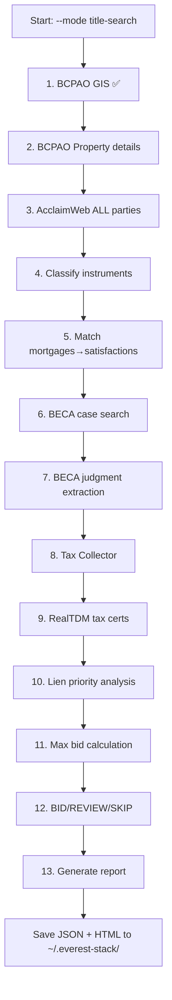

# everest-stack development

## Overview
Claude Code plugin for foreclosure deal intelligence. 10 skills, 64 tests, deployed to Hetzner.
Upstream: garrytan/gstack. Rewritten for Brevard County real estate investing.

## Commands
```bash
npm test              # 64 assertions, <2s
npm run test:evals    # paid evals (diff-based, ~$4/run max)
```

## Project structure
```
everest-stack/
├── CLAUDE.md                    # THIS FILE — root directive
├── ETHOS.md                     # 5 principles (read before any deal work)
├── AGENTS.md                    # Agent definitions
├── SKILL.md                     # Root manifest (10 skills)
├── scrapers/
│   ├── property_scraper.py      # Unified scraper (BCPAO GIS + AcclaimWeb)
│   ├── acclaimweb_playwright.py # Headless browser for AcclaimWeb
│   └── __init__.py
├── deal-office-hours/SKILL.md   # 6 forcing questions, BID/REVIEW/SKIP
├── lien-audit/SKILL.md          # Lien priority verification
├── deal-ceo-review/SKILL.md     # Portfolio strategy review
├── deal-eng-review/SKILL.md     # Pipeline architecture review
├── deal-review/SKILL.md         # Pre-deploy code review
├── deal-ship/SKILL.md           # Test→review→push→deploy
├── qa-property/SKILL.md         # Cross-reference property data
├── market-intel/SKILL.md        # Comps, demographics, rentals
├── nexus-retro/SKILL.md         # Weekly ecosystem retrospective
├── eval-judge/SKILL.md          # 3-tier eval system
└── test/
    ├── skill-validation.test.js # 64 assertions
    ├── fixtures/                # deal-scenarios.json, lien-scenarios.json
    └── helpers/                 # llm-judge, eval-store, touchfiles
```

## Hetzner deployment
- Plugin: `/home/claude/.claude/skills/everest-stack`
- SSH: `root@87.99.129.125` via `HETZNER_SSH_KEY`
- Deploy: `cli-anything-biddeed/.github/workflows/deploy-everest-stack.yml`
- Cron: upstream-sync Sun 9AM EST, repo-forensics Sun 9:05AM EST

---

# 🔴 CURRENT MISSION: Phase 4b — Full Title Search Pipeline

## Context
Phase 4a deployed `property_scraper.py` with BCPAO GIS + AcclaimWeb Playwright.
Tested on real case: **05-2025-CC-022459 — VIERA EAST VS AMY L HORL**
- BCPAO GIS: ✅ Found property (2046 Deercroft Dr, $299,700)
- AcclaimWeb Playwright: ✅ Found 5 instruments, 0 mortgages
- BUT: judgment amount unknown, taxes unchecked, instruments unclassified

## The Problem
The report says "❌ Unknown" on 4 items. That's unacceptable.
Every line must say "scraped and verified". Zero HITL.

## What Must Be Built

### property_scraper.py --mode title-search

A single command that runs the full 13-point title search autonomously:

```
python3 scrapers/property_scraper.py \
  --owner "AMY HORL" \
  --case "05-2025-CC-022459-XXCC-BC" \
  --mode title-search
```

### 13 Points of Title Search

```yaml
title_search_pipeline:
  # PROPERTY IDENTIFICATION (existing, working)
  1_bcpao_gis:
    source: gis.brevardfl.gov GIS REST API
    fields: PARCEL_ID, OWNER_NAME1, OWNER_NAME2, address, values, living_area
    status: ✅ WORKING (field names fixed)
    code: scrapers/property_scraper.py search_bcpao_gis()
    
  2_bcpao_property:
    source: bcpao.us Property API
    fields: year_built, beds, baths, photos, homestead, sale_history
    status: ⚠️ API returns 403 from server IPs
    fix: Use GStack /browse daemon OR add year_built to GIS query if available
    fallback: Web search for property details (working)

  # LIEN DISCOVERY (needs wiring)
  3_acclaimweb_all_parties:
    source: vaclmweb1.brevardclerk.us (Playwright browser)
    action: Search under EVERY owner name (HORL + TORRES + any LLC/trust)
    extract: ALL recorded instruments — mortgages, satisfactions, liens, LP, deeds
    status: ⚠️ PARTIAL — searches one name, needs to search all parties
    fix: Loop through all OWNER_NAME1 + OWNER_NAME2 from BCPAO
    code: scrapers/acclaimweb_playwright.py (exists, needs multi-party loop)

  4_instrument_classification:
    source: AcclaimWeb results from step 3
    action: Classify every instrument by doc type code
    types:
      mortgage: MTG, SMTG, AMTG, MTGMOD, HELOC
      satisfaction: SAT, SATIS, SATMTG, RELEASE, DISCHARGE
      hoa_lien: LIEN where party matches HOA keywords
      judgment_lien: JDGMT, JUDGMENT
      lis_pendens: LP, LIS PENDENS
      federal_tax_lien: FTL, FEDERAL TAX LIEN
      deed: WD, QCD, DEED, TRUSTEE DEED, SPECIAL WD
      assignment: ASGN, ASSIGNMENT
      other: anything else
    status: ⚠️ PARTIAL — classifier exists but too narrow, 5 went to "other"
    fix: Expand classify_instruments() with full doc type map above
    code: scrapers/property_scraper.py classify_instruments()

  5_mortgage_matching:
    source: Classified instruments from step 4
    action: Match each mortgage to its satisfaction (by book/page or CFN reference)
    output: List of ACTIVE (unsatisfied) mortgages with amounts
    status: ❌ NOT BUILT
    fix: New function match_mortgages_to_satisfactions()

  # CASE DATA (needs wiring from BECA)
  6_beca_case_search:
    source: vmatrix1.brevardclerk.us/beca (Playwright browser)
    action: Pull case details — plaintiff, defendant, filing date, status
    status: ❌ NOT BUILT in everest-stack
    existing_code: brevard-bidder-scraper/scripts/beca_scraper_v3.py
    fix: Port BECA case search to everest-stack/scrapers/beca_playwright.py

  7_beca_judgment_extraction:
    source: Case PDF from BECA (final judgment document)
    action: Extract final judgment amount, date, and terms using regex
    regex_patterns: 12 patterns from BECA V22 (amount, date, plaintiff, defendant)
    status: ❌ NOT BUILT in everest-stack
    existing_code: brevard-bidder-scraper/src/scrapers/beca_final_judgment_scraper.py
    fix: Port judgment extraction to everest-stack

  # TAX STATUS (needs building)
  8_tax_collector:
    source: brevardtaxcollector.com
    action: Check current year paid/unpaid, prior delinquencies
    status: ❌ NOT BUILT
    fix: New scraper — simple HTTP GET by parcel ID or account number

  9_realtdm_tax_certs:
    source: RealTDM (tax certificate search)
    action: Check for outstanding tax certificates on parcel
    status: ❌ NOT BUILT in everest-stack
    existing_code: brevard-bidder-scraper/src/scrapers/realtdm_scraper.py
    fix: Port to everest-stack

  # ANALYSIS (needs wiring)
  10_lien_priority_analysis:
    source: All data from steps 1-9
    action: Apply Florida lien priority rules
    rules:
      - Property taxes ALWAYS superior
      - First mortgage SURVIVES HOA foreclosure
      - Junior liens extinguished by senior foreclosure
      - Federal tax lien = 120-day redemption
      - Code enforcement = check recording date
    output: Lien hierarchy table with survive/extinguish status
    status: ❌ NOT WIRED
    existing_code: brevard-bidder-scraper/.claude/skills/biddeed-lien-discovery/scripts/analyze_lien_priority.py
    fix: Port and wire to property_scraper output

  11_max_bid_calculation:
    source: ARV from comps + lien analysis
    formula: (ARV × 70%) - Repairs - $10K - MIN($25K, 15% × ARV)
    adjust: If HOA foreclosure with surviving mortgage, subtract payoff amount
    status: ✅ FORMULA EXISTS in deal-office-hours/SKILL.md
    fix: Implement as Python function in property_scraper.py

  # OUTPUT
  12_bid_recommendation:
    source: Max bid + judgment amount
    logic:
      bid_judgment_ratio: max_bid / judgment_amount
      BID: ratio >= 75%
      REVIEW: ratio 60-74%
      SKIP: ratio < 60%
    status: ✅ LOGIC EXISTS in deal-office-hours/SKILL.md
    fix: Implement as Python function

  13_report_generation:
    source: All data from steps 1-12
    output: JSON report + HTML report (like horl-title-search-lien-audit.html)
    every_field: "scraped and verified" or "source unavailable" (NEVER "unknown")
    status: ⚠️ HTML report exists but has ❌ Unknown fields
    fix: Generate report from scraper output, not manually
```

## Source Code Locations (brevard-bidder-scraper repo)

```yaml
beca_scraper: scripts/beca_scraper_v3.py
beca_judgment: src/scrapers/beca_final_judgment_scraper.py
beca_agent: .claude/agents/beca-scraper.md
acclaimweb: src/scrapers/acclaimweb_scraper_native.py  # Playwright version
bcpao: src/scrapers/bcpao_scraper_v4.py
bcpao_photos: src/scrapers/bcpao_photo_extractor.py
lien_priority: .claude/skills/biddeed-lien-discovery/scripts/analyze_lien_priority.py
max_bid: .claude/skills/biddeed-foreclosure-analysis/scripts/calculate_max_bid.py
recommendation: .claude/skills/biddeed-foreclosure-analysis/scripts/determine_recommendation.py
report_gen: .claude/skills/biddeed-report-generation/SKILL.md
```

## Execution Plan



## Test Case: VIERA EAST VS AMY L HORL

```yaml
case: 05-2025-CC-022459-XXCC-BC
plaintiff: VIERA EAST (HOA)
defendant: AMY L HORL
co_owner: TORRES, JOSE A
address: 2046 Deercroft Dr, Melbourne, FL 32940
parcel: 25 3633-RZ-B-5
account: 2531736
year_built: 2001
beds_baths: 3/2
sqft: 1506
just_value: 299700
subdivision: BAYHILL AT VIERA EAST PHASE TWO
auction_date: 2026-04-15
auction_location: Titusville courthouse 11AM
type: HOA_FORECLOSURE
homestead: $25,000 exemption
```

## Rules

- NEVER-LIE: If a scraper fails, report "source unavailable" not "unknown"
- Every field in the report must show its data source
- Search AcclaimWeb under ALL party names, not just defendant
- HOA foreclosure = senior mortgage SURVIVES — this changes everything
- Test with HORL case above — all 13 points must resolve
- Cost discipline: Playwright is free, BECA PDF extraction is free, LLM only for classification edge cases

## Dependencies on Hetzner

```bash
pip install requests beautifulsoup4 playwright --break-system-packages
playwright install chromium
# pdfplumber for BECA PDF extraction
pip install pdfplumber --break-system-packages
```

## Done When

```
python3 scrapers/property_scraper.py \
  --owner "AMY HORL" \
  --case "05-2025-CC-022459-XXCC-BC" \
  --mode title-search
```

Produces a JSON report where every field says "verified" or "source_unavailable".
Zero fields say "unknown". Zero HITL. Report auto-generates as HTML.
